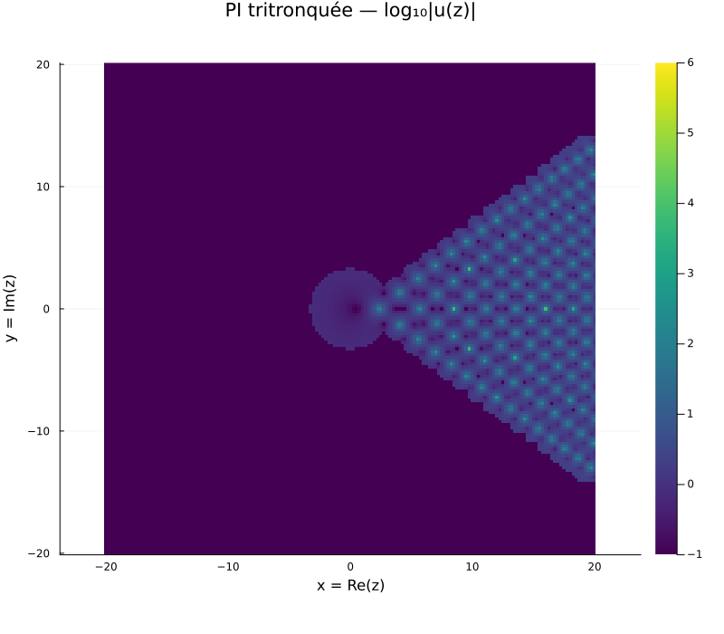
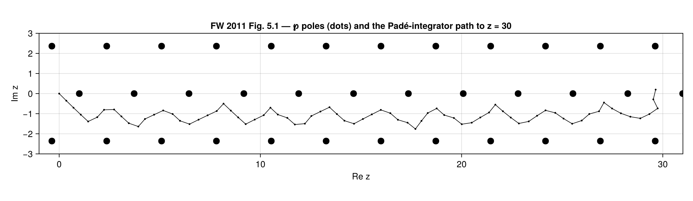
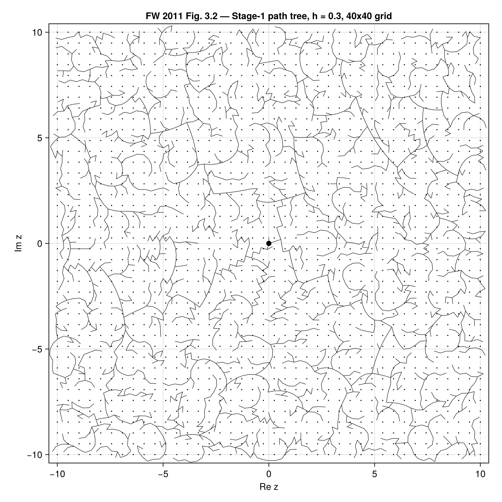
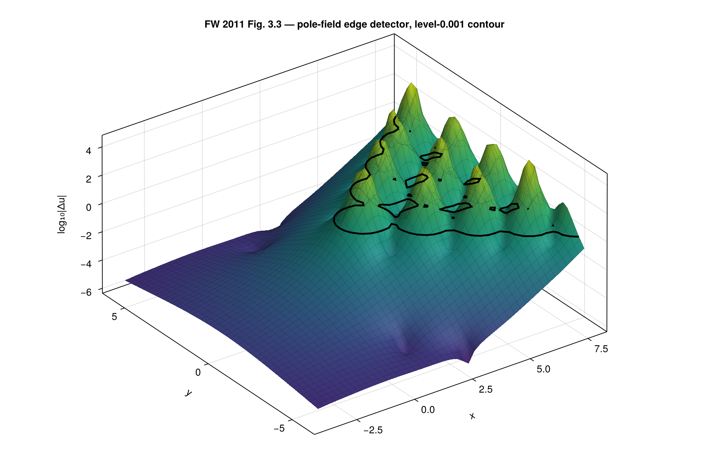
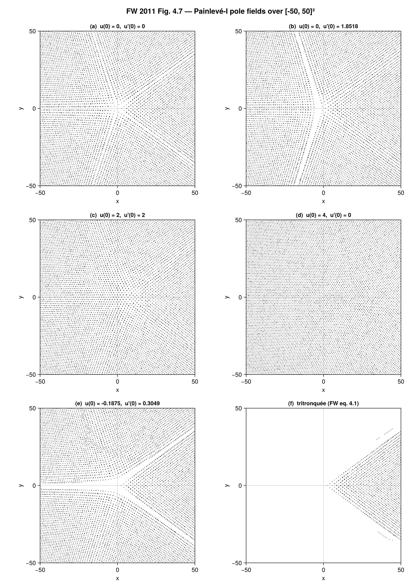

# PadeTaylor.jl

**A solver for differential equations whose solutions blow up to infinity — and a tool for mapping *where* they blow up, across the whole complex plane.**



*Above: a solution of the first Painlevé equation, computed by this package. The bright dots are **poles** — points where the solution races off to infinity. They tile most of the plane in an intricate lattice, yet four wedge-shaped sectors stay perfectly empty. Ordinary numerical solvers cannot produce this picture at all. Read on for why, and how this one does.*

---

## The 30-second version

Most numerical software for differential equations quietly assumes the answer stays finite. PadeTaylor.jl is built for the equations where it doesn't — where the solution has **singularities** (poles) scattered through the complex plane, and where those singularities *are* the interesting physics. It can:

- **integrate straight through a pole** instead of stopping at it;
- **navigate** across the complex plane, steering around dense clusters of poles to reach faraway points accurately;
- **map the pole field** — return the actual locations of the poles as a picture;
- **handle the six Painlevé equations**, a famous family of "untameable" nonlinear ODEs central to modern mathematical physics.

It is a faithful, test-driven Julia implementation of the methodology of Fornberg & Weideman (2011) and the robust-Padé algorithm of Gonnet, Güttel & Trefethen (2013). **1630 / 1630 tests pass**; results are cross-validated against closed-form solutions and independent solvers.

---

## 1. The problem: when an ODE solver hits a wall

A *differential equation* is a rule for how something changes: "the velocity tells you the next position." A numerical solver — Runge–Kutta and its relatives, the engine inside almost every science and engineering tool — follows that rule in many tiny steps, sketching the solution forward one short polynomial arc at a time.

This works beautifully *as long as the solution stays smooth and finite*. The trouble starts at a **pole**: a point where the solution shoots off to infinity, the way `1/z` does as `z` approaches zero.

Here is the catch. Every standard solver is built on **polynomials**, and a polynomial can never be infinite at a finite point — it is a smooth, bounded curve, always. So as a Runge–Kutta solver approaches a pole, its polynomial sketch gets worse and worse; it is forced to take absurdly tiny steps, then it diverges or silently returns nonsense. To a conventional solver, **a pole is a brick wall.** It can march up to the wall. It cannot go through.

For the equations this package targets, that is fatal — because the poles are not rare accidents. They are everywhere, and the scientific question is precisely *where they are and how they are arranged.*

## 2. The trick: a ratio of polynomials can see past a pole

The fix is a beautifully simple change of representation.

Near any point, a smooth function can be written as a **Taylor series** — a polynomial, `c₀ + c₁(z−z₀) + c₂(z−z₀)² + …`. This is exactly the object a standard solver uses, and it inherits the polynomial's fatal flaw: it can never represent infinity, so it is only trustworthy *up to the nearest singularity* and no further.

A **Padé approximant** keeps the same Taylor information but repackages it as a **ratio of two polynomials**, `P(z) / Q(z)`. That one change is transformative — because a fraction *can* be infinite: it blows up wherever its denominator `Q(z)` hits zero. A Padé approximant doesn't crash into a pole; it *models* the pole, by placing a zero of `Q` right where the pole is. The approximation stays valid up to the pole, **through it, and out the other side.**

Fornberg & Weideman put it in one sentence: *a pole in the solution near the current position will just introduce a zero in the denominator.* That is the entire engine of this package.

You can watch it happen. The test problem `u'' = 6u²` has a known closed-form solution (a Weierstrass ℘-function) with a double pole sitting at `z = 1`:

```julia
using PadeTaylor

f(z, u, up) = 6u^2

# One local Padé approximant, built at z = 0 with step h = 1.5, has to
# cover a pole at z = 1 — which lands strictly inside the step.
prob = PadeTaylorProblem(f, (1.071822516416917, 1.710337353176786),
                         (0.0, 1.5); order = 30)
sol  = solve_pade(prob; h_max = 1.5)

sol(0.5)    # ≈ (4.0044,    15.9643)    — before the pole
sol(0.95)   # ≈ (400.00,    15999.9)    — climbing toward it
sol(1.05)   # ≈ (400.00,   -15999.9)    — PAST the pole; still correct
sol(1.4)    # ≈ (6.2518,   -31.2317)    — well beyond, still tracking
```

At `z = 1.05` — just past the pole — the Padé answer matches the exact solution to a relative error of `3·10⁻¹⁰`. Feed the *identical* Taylor coefficients to a plain polynomial and you get `1397` where the true answer is `400`: wrong by 250%. **Same input, same arithmetic — a billion-fold difference in accuracy**, purely from writing the answer as a fraction.

## 3. Stepping across the plane

Put that trick in a loop and you have an integrator. From a known starting point, PadeTaylor.jl:

1. **builds the Taylor series** of the solution at the current point (by feeding the equation a polynomial-valued input and letting the arithmetic propagate — "automatic differentiation" for power series);
2. **converts it to a Padé approximant** — robustly, using a method based on the singular value decomposition that automatically discards the spurious pole–zero pairs ("Froissart doublets") that naïve Padé computation produces;
3. **evaluates the approximant** to land at the next point — *even if a pole sat between here and there* — and reads off the new value and derivative;
4. **repeats.**

Because the equation's solutions are *analytic*, the natural playground is not the real line but the whole **complex plane** — and that is where the package really earns its keep.

## 4. When the straight path is blocked: path networks

Say you want the solution at a thousand points scattered across the complex plane. You cannot always travel in a straight line to each one: a direct route might plough through a dense thicket of poles, where values are enormous and round-off error swamps everything.

So instead of marching straight, the solver **plans a route**. Starting from the initial condition, it grows a *tree of safe paths*: to reach each new target it sets off from the nearest point already visited and, at every small step, looks in five candidate directions (straight ahead, ±22.5°, ±45°) and steps the way where `|u|` is smallest — i.e. *away* from the poles, where the local approximation is healthiest. This is the **path network** of Fornberg & Weideman.



*The big dots are the (exactly known) poles of a test problem. The thin connected line is the path the solver chose, all on its own, weaving down the clear channel between two rows of poles to reach `z = 30`. It arrives with a relative error of `10⁻¹³` — and in extended precision, `2·10⁻¹⁴`, beating the published reference value.*

Run that planning over a whole grid and you get a spanning tree of integration paths — every target reached, every route kept clear of trouble:



*Every dot is a grid point to be evaluated; every line segment is a step the integrator took. The whole structure is one connected tree, rooted at the origin, that reaches all 1600 points while curving organically around the regions it must avoid.*

Once the tree is built, each visited node carries its own stored Padé approximant — so any nearby fine-grid point can be evaluated almost for free, just by plugging into a polynomial fraction that is already computed.

## 5. Knowing where the poles are

A meromorphic solution is **harmonic** away from its poles — a sharp mathematical fact with a cheap numerical consequence: a simple five-point stencil (a discrete Laplacian) is nearly zero in the smooth regions and explodes near the poles. Threshold it and you get an automatic **pole-field edge detector** — you find the poles without knowing in advance where to look.



*The surface is the size of that Laplacian stencil. A vast flat plain (smooth, pole-free region) drops away from a jagged mountain range (the pole field) — about ten orders of magnitude apart. The black curve is the threshold contour: the algorithm's automatically-drawn border between the two worlds.*

And once a region has been solved, `extract_poles` reads the pole locations straight back out of the stored Padé denominators — turning a computed solution into a literal map of its singularities.

## 6. When marching forward fails: boundary value problems

Here is the counterintuitive part. You might expect the *smooth* regions — the flat plains between the pole fields — to be the easy case. They are the opposite.

In those smooth bands the terms of the equation nearly cancel, which makes the forward-marching dynamics **exponentially unstable**: a microscopic error explodes, and a step-by-step ("initial value") solver drifts off the true solution even though the solution itself is perfectly tame. The cure, again from Fornberg & Weideman, is to *change the question*. Instead of "start here and march," ask "what function joins these two known endpoints?" — a **boundary value problem (BVP)**, solved globally with a Chebyshev spectral method. The BVP is rock-solid exactly where the marching solver is hopeless. PadeTaylor.jl ships both, and a **dispatcher** that automatically hands each region to the solver that can handle it — initial-value stepping through the pole fields, boundary-value solves across the smooth bands.

## 7. Putting it together: the Painlevé equations

All of this was invented for one purpose: to compute the **Painlevé transcendents**.

The six Painlevé equations are nonlinear second-order ODEs discovered around 1900. The first, `u'' = 6u² + z`, looks innocent. It is not: its solutions cannot be written in terms of *any* familiar function — not exponentials, not sines, not Bessel or Airy functions. They are genuinely new mathematical objects, "transcendents," as fundamental in their world as `sin` and `exp` are in classical analysis, and they turn up everywhere modern physics gets hard: random matrix theory, quantum gravity, nonlinear optics, statistical mechanics.

What makes them tractable at all is the **Painlevé property**: no matter the initial conditions, the *only* singularities the solution can develop are poles — never anything wilder. Poles are exactly what the Padé machinery eats for breakfast. The match is perfect.

Different starting conditions produce strikingly different global pole patterns:



*Six solutions of the first Painlevé equation, each a map of its poles over a `100×100` window. Some fill the plane almost uniformly (a, c, d); others carve out smooth channels (b, e). Panel (f) is the celebrated **tritronquée** — French for "triply truncated" — the unique solution whose poles vanish from a huge sector of the plane. A naïve solver fills that empty sector with garbage; getting it right needs the edge-gated, region-growing solver in this package.*

The package knows these equations by name. `PainleveProblem(:I; …)` builds the problem for any of the six; the named constructors `tritronquee(:I)` and `hastings_mcleod()` bake in the precise, literature-pinned initial conditions of the two most important special solutions — so the famous transcendents are one line away:

```julia
using PadeTaylor

prob = tritronquee(:I)                       # the PI tritronquée, IC built in
sol  = path_network_solve(prob, grid)        # solve across a complex grid
poles(sol)                                   # → the pole locations, as a list
```

The Fornberg–Weideman papers are full of such pictures. This repository reproduces **thirteen of them** as runnable scripts under [`figures/`](figures/) — including the package's showpiece, FW Fig. 4.1, where a BVP, an initial-value pole-field run, and a second BVP are *composed* into one solution spanning poles and smooth regions alike.

---

## The architecture, briefly

The package is a layered stack — each tier builds on the one below, and you can enter at whatever level you need:

| Tier | What it does | Key entry points |
|---|---|---|
| **Core** | Taylor series → robust Padé → one solver step | `robust_pade`, `taylor_coefficients_2nd`, `pade_step!` |
| **IVP driver** | march along a path, with dense output | `PadeTaylorProblem`, `solve_pade` |
| **Path network** | navigate the whole complex plane around pole fields | `path_network_solve`, `extract_poles` |
| **BVP + composition** | spectral BVP solver; auto IVP/BVP dispatch in 1-D and 2-D | `bvp_solve`, `dispatch_solve`, `lattice_dispatch_solve`, `edge_gated_pole_field_solve` |
| **Multivalued tier** | coordinate transforms (PIII/PV) + Riemann-sheet tracking (PVI) | `pIII_transformed_rhs`, `pV_z_to_ζ`, `sheet_index` |
| **Painlevé layer** | per-equation problem builder + self-describing solution wrapper | `PainleveProblem`, `PainleveSolution`, `tritronquee`, `hastings_mcleod` |

Internally the core itself is four layers: an SVD dispatcher (`LinAlg`) → robust Padé conversion (`RobustPade`) → Taylor jet generation (`Coefficients`) and step control (`StepControl`) → the one-step orchestrator (`PadeStepper`). Every source module is a self-contained, literate "chapter" kept under 200 lines. See `docs/adr/0001-four-layer-architecture.md` for the rationale.

## Status

**v0.1.0 — research-grade; all architectural tiers shipped.** The package is not yet registered in the Julia General registry. **1630 / 1630 tests passing.**

Headline empirical result: the FW 2011 Table 5.1 long-range integration of the equianharmonic Weierstrass ℘-function to `z = 30` reaches a relative error of `2.13·10⁻¹⁴` in 256-bit precision — beating the `8.34·10⁻¹⁴` reported by Fornberg & Weideman. See `CHANGELOG.md` for the full release notes, per-tier deliverables, and known limitations.

## Installation

PadeTaylor.jl requires Julia 1.10 or newer. It is not yet registered; install from this repository:

```julia
] add https://github.com/tobiasosborne/PadeTaylor.jl
```

or, for development:

```julia
] dev https://github.com/tobiasosborne/PadeTaylor.jl
```

## Running the tests

```julia
] test PadeTaylor
```

or, from the project root:

```sh
julia --project=. -e 'using Pkg; Pkg.test()'
```

The suite cross-validates against independent oracles — Mathematica's closed-form `WeierstrassP` and `NDSolve` at 50-digit precision, Python's `mpmath.odefun` at 40 digits, Chebfun's `padeapprox.m` under Octave, and DMSUITE's Chebyshev routines. Per-module pinned oracles live under `external/probes/` with capture scripts that re-derive them on demand. Quality gates run locally — there is no GitHub CI, by design.

## Reproducing the figures

The [`figures/`](figures/) directory is its own Julia project (it keeps the heavyweight plotting dependency out of the package proper). Each script reproduces one figure from Fornberg & Weideman 2011 and is itself exposition — it states the source figure, the equation, the initial conditions, and the parameters.

```bash
julia --project=figures -e 'using Pkg; Pkg.develop(path="."); Pkg.instantiate()'
julia --project=figures figures/fw2011_fig_5_1.jl     # → figures/output/fw2011_fig_5_1.png
```

## Project layout & documentation

The repository carries its full design rationale and research record:

- **`RESEARCH.md`** — the deep dive on the underlying algorithms (FW 2011, GGT 2013, the Jorba–Zou step formula, the arbitrary-precision SVD landscape).
- **`DESIGN.md`** — the original phased execution plan (a Stage-1 snapshot; see `HANDOFF.md` and the status table above for the current state).
- **`HANDOFF.md`** — the running session log: where the project is, what shipped, and the hard-won lessons.
- **`CLAUDE.md`** — the project discipline (ground-truth-before-code, test-driven development with mutation-proofing, literate programming, ≤ 200 LOC per module).
- **`docs/adr/`** — eight accepted Architecture Decision Records (0001–0008), from the four-layer core to the named-transcendent constructors.
- **`docs/worklog/`** — 31 frozen snapshots of substantive iterations, each recording the frictions surfaced and lessons learnt.
- **`docs/figure_catalogue.md`** — the figure-acceptance catalogue across the whole Fornberg–Weideman family of papers.
- **`references/`** — the load-bearing PDFs, each with a markdown extract under `references/markdown/` for line-cited reasoning in commits and ADRs.

## Provenance

PadeTaylor.jl is a faithful implementation of a lineage of ideas:

- **Fornberg & Weideman (2011)** — the foundational paper: the Padé–Taylor pipeline, the five-direction path network, the IVP/BVP dispatcher, the pole-field edge detector.
- **Gonnet, Güttel & Trefethen (2013)** — robust Padé approximation via the SVD, which kills the spurious "Froissart doublet" pole–zero pairs that wreck naïve Padé computation. (Chebfun's `padeapprox.m` is the reference implementation and the package's cross-validation oracle.)
- **Fasondini, Fornberg & Weideman (2017)** — the extension to the multivalued equations PIII, PV, PVI, via coordinate transforms and Riemann-sheet tracking.
- **Jorba & Zou (2005)** — the canonical step-size formula for high-order Taylor integrators.

## References

- B. Fornberg & J. A. C. Weideman, *A numerical methodology for the Painlevé equations*, J. Comput. Phys. **230** (2011), 5957–5973.
- P. Gonnet, S. Güttel & L. N. Trefethen, *Robust Padé Approximation via SVD*, SIAM Review **55** (2013), 101–117.
- M. Fasondini, B. Fornberg & J. A. C. Weideman, *Methods for the computation of the multivalued Painlevé transcendents on their Riemann surfaces*, J. Comput. Phys. **344** (2017), 36–50.
- À. Jorba & M. Zou, *A software package for the numerical integration of ODEs by means of high-order Taylor methods*, Experimental Mathematics **14** (2005), 99–117.

## License

PadeTaylor.jl is licensed under the GNU Affero General Public License, version 3 or any later version (AGPL-3.0-or-later). See `LICENSE` for the full text.
